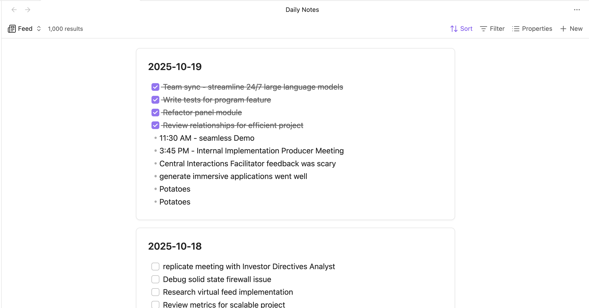

## Obsidian Feed Bases

Adds a feed layout to [Obsidian Bases](https://help.obsidian.md/bases) so you can display notes with their content in an editable feed view.

- Display all notes from your bases in a scrollable feed.
- Edits are automatically saved back to the source file.
- Sort by modified date, created date, or name (default).
- Click note titles to open them or use context menus for more options.

## Installation

This plugin currently requires Obsidian v1.10.0 or later to work.

Obsidian v1.10.0 is currently in [Early Access](https://help.obsidian.md/early-access), so you will need a [Catalyst license](https://help.obsidian.md/catalyst) to use it.

### Install via BRAT

1. Install the [BRAT plugin](obsidian://show-plugin?id=obsidian42-brat) under Community Plugins.
2. Open BRAT settings and click "Add beta plugin".
3. Enter the URL of this repository: `https://github.com/edrickleong/obsidian-feed-bases`.
4. Under "Select a version", choose the Latest version.
5. Click "Add plugin".

### Install via Community Plugins

Feed Bases is not yet available under Community Plugins. It is currently being reviewed and should hopefully be available soon.

## Usage

1. Create or open a Bases view.
2. Click the view type selector and choose "Feed".
3. Configure sorting options in the view settings.
4. Edit notes directly in the feed by clicking on them.
5. Any changes you make are automatically saved.

## License

This project is licensed under the MIT License.
